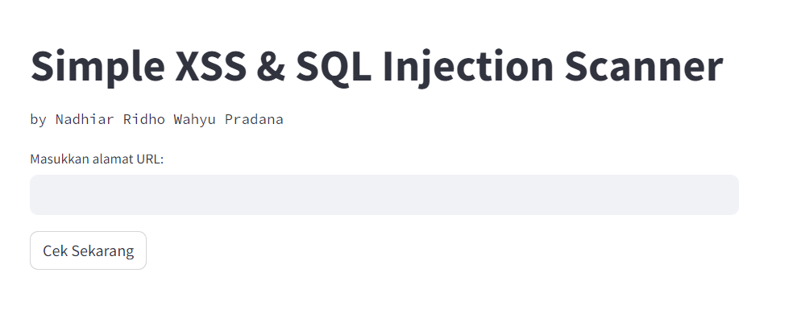
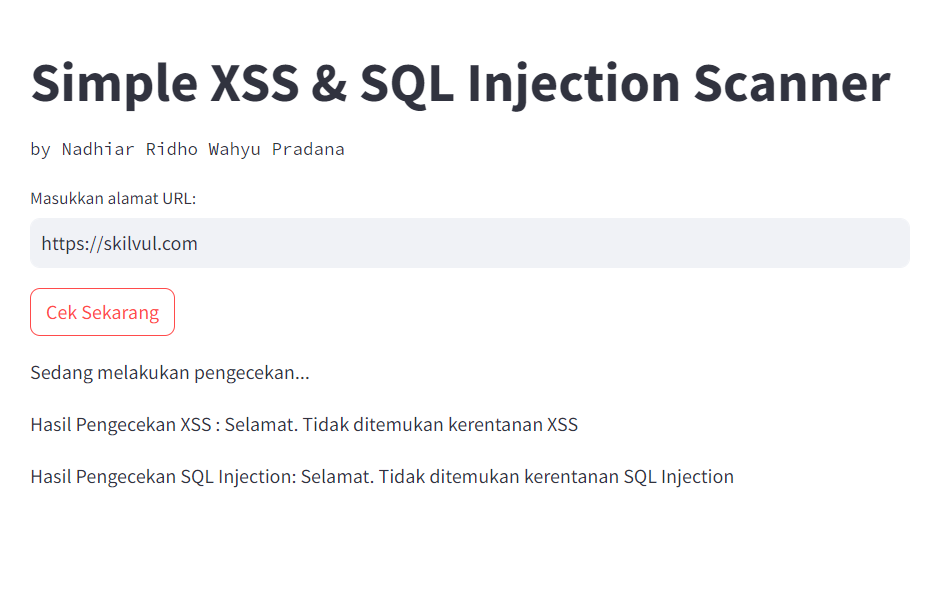
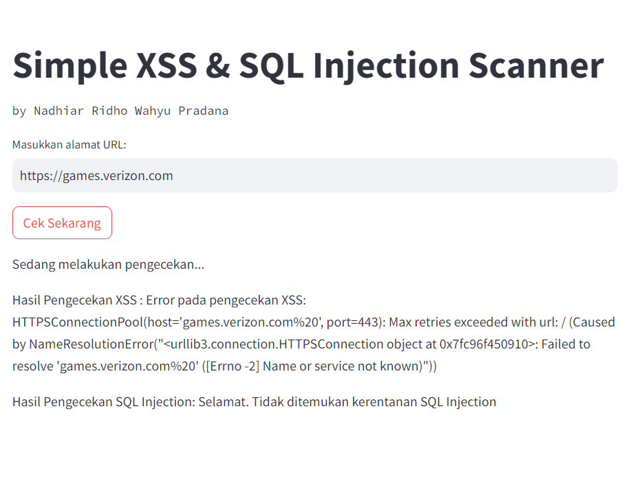
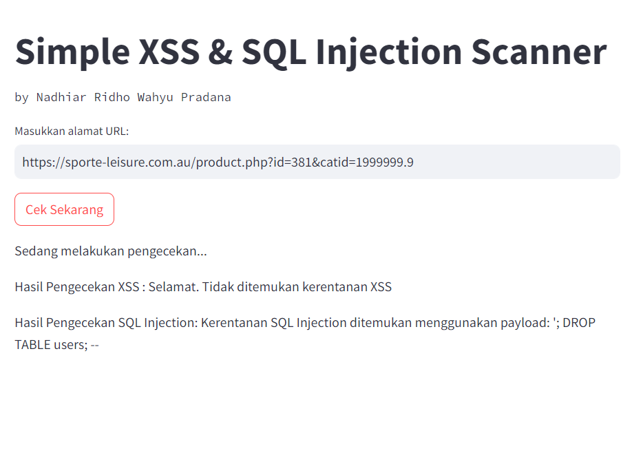

# Simple XSS & SQL Injection Scanner

## Overview
Proyek ini adalah *Simple XSS & SQL Injection Scanner* yang dirancang untuk menganalisis URL guna menemukan potensi kerentanan. Dibangun menggunakan Python dan Streamlit, pemindai ini bertujuan memberikan antarmuka yang sederhana dan ramah pengguna bagi para penggemar keamanan dan pengembang untuk memeriksa apakah URL yang diberikan rentan terhadap serangan XSS dan/atau SQL Injection.

## Fitur
- **Pemeriksaan Kerentanan XSS:** Mengidentifikasi potensi kerentanan Cross-Site Scripting pada URL yang diberikan.
- **Pemeriksaan SQL Injection:** Memindai potensi kerentanan SQL Injection pada URL yang ditentukan.
- **Antarmuka Ramah Pengguna:** Menggunakan Streamlit untuk pengalaman yang mudah digunakan.
- **Analisis Cepat:** Menyediakan penilaian cepat terhadap status keamanan URL.

## Cara Penggunaan

Pengguna dapat mengakses **[link](https://nadhiar-skilvul.streamlit.app/)** berikut untuk mengakses aplikasi dalam versi website. 
- Akses [link](https://nadhiar-skilvul.streamlit.app/) hingga muncul halaman berikut.

- Masukkan URL website yang ingin dipindahi.

- Berikut contoh URL dengan kerentanan XSS

- Berikut contoh URL dengan kerentanan SQL Injection


## How to Deploy
atau dapat melakukan cloning repository ini.

- Klon repositori ke mesin lokal Anda.
```bash
git clone https://github.com/nrwpradana/xss-sql-test.git
```

- Instal dependensi yang diperlukan.
```bash
pip install -r requirements.txt
```

- Jalankan aplikasi Streamlit.
```bash
streamlit run app.py
```
- Akses aplikasi melalui browser web Anda di [http://localhost:8501]() dan masukkan URL target untuk dipindai.

## Disclaimer
Alat ini ditujukan untuk tujuan pendidikan dan kesadaran saja. Gunakan dengan tanggung jawab dan hanya pada situs web yang Anda miliki izin eksplisit untuk diuji. Berikut adalah payloads sederhana yang digunakan dan bisa diubah/ditambahkan sesuai kebutuhan.

### XSS Payloads
```bash
<script>alert('XSS')</script>
```
### SQL Injection Payloads
```bash
'; DROP TABLE users; --
'; SELECT * FROM users; --
' OR '1'='1'; --
" OR "1"="1"; --
'; --
"; --
--
#
';/*
') OR ('1'='1'); --
UNION SELECT username, password FROM users; --
```

## Lisensi
Proyek ini dilisensikan di bawah Lisensi [MIT](https://choosealicense.com/licenses/mit/).